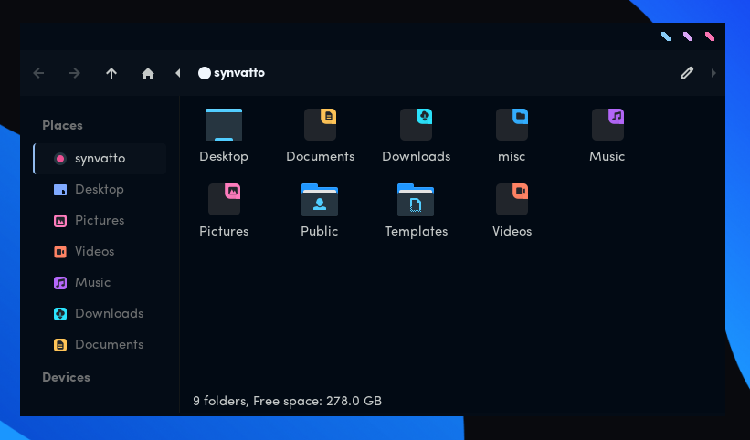

<h1 align="center">
	 
	Articblush GTK</a>
  </h1>

 <h3 align="center">Ice Your Desktop with articblush gtk.</h3>
 
 ----

 
  

 

> This repository contains the Articblush GTK theme, as well as custom CSS for the Thunar file manager.
